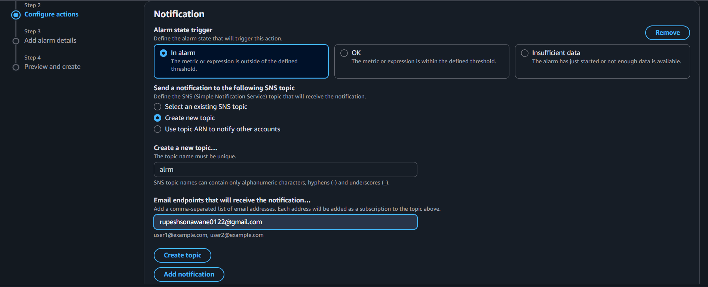
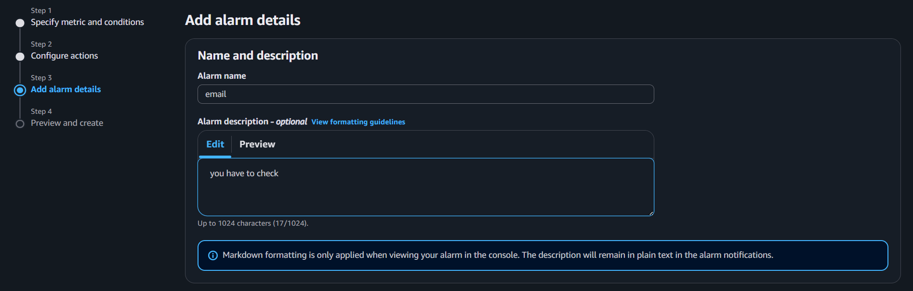
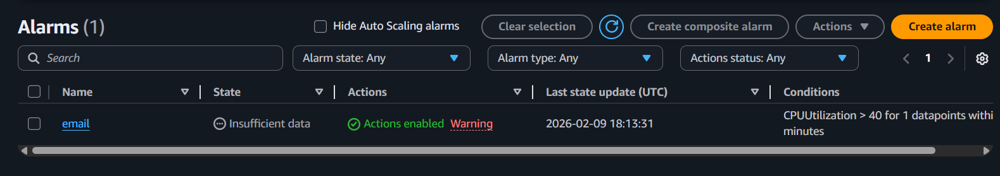
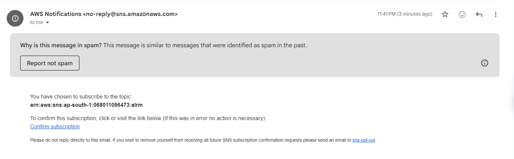
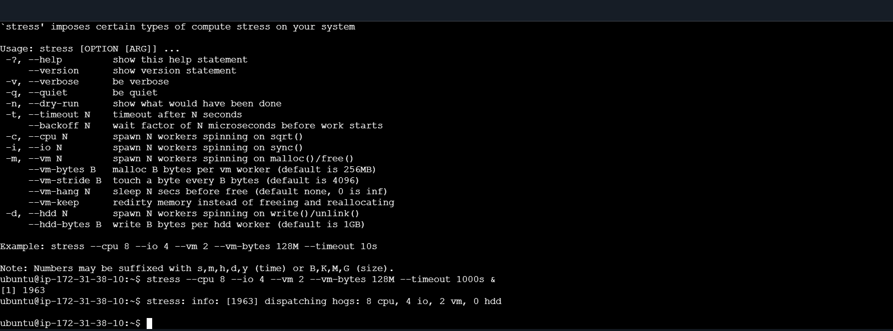
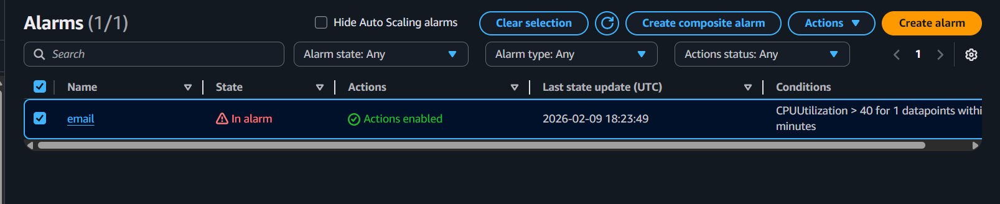
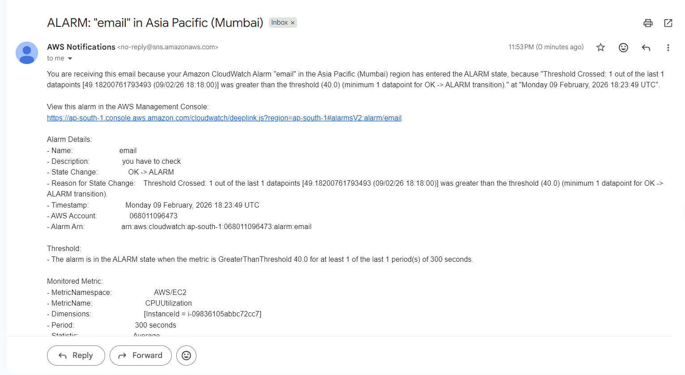

# aws-cloudwatch-email-alert-project
# AWS CloudWatch EC2 Monitoring with Email Alert

## Project Overview

This project demonstrates how to monitor an Amazon EC2 instance using Amazon CloudWatch and automatically send email notifications when CPU utilization crosses a defined threshold.

The implementation ensures proactive incident detection and reduces downtime risk through real-time alerting.

---

## Architecture

**Workflow**

EC2 Instance → CloudWatch Metric → CloudWatch Alarm → SNS Topic → Email Notification

---

## Services Used

- Amazon EC2
- Amazon CloudWatch
- Amazon SNS
- Linux (Ubuntu)
- Stress Tool

---

## Objective

- Monitor EC2 CPU Utilization
- Trigger Alarm when threshold exceeds 40%
- Send automatic email notification
- Demonstrate real-time infrastructure monitoring

---

## Implementation Steps (With Proof)

### 1. Configure Alarm Threshold

---

### 2. Configure SNS Topic and Email Notification

---

### 3. Add Alarm Name and Description

---

### 4. Alarm Created (Initial State)

---

### 5. Confirm Email Subscription

---

### 6. Alarm State Changes to OK

---

### 7. Generate CPU Load Using Stress Tool

---

### 8. Verify CPU Usage with TOP Command

---

### 9. Email Alert Received from AWS

---

### 10. Alarm State Changed to "In Alarm"

---

### 11. Final Alert Email Details

---

## Outcome

- Enabled real-time infrastructure monitoring.
- Reduced incident response time with automated alerts.
- Demonstrated practical AWS CloudWatch and SNS integration.
- Validated CPU threshold-based alerting workflow.

---

## Skills Demonstrated

- AWS EC2 Monitoring
- CloudWatch Metrics & Alarms
- SNS Notification Configuration
- Linux Performance Testing
- Incident Response Automation
- Cloud Infrastructure Observability

---

## Future Improvements

- Integrate Auto Scaling based on CloudWatch Alarm
- Automate deployment using Terraform
- Add centralized logging using CloudWatch Logs
- Implement multi-instance monitoring

---

## Author

**Rupesh Sonawane**

- GitHub: https://github.com/rupeshsonawane0012
- LinkedIn: https://linkedin.com/in/rupesh-sonawane12/
